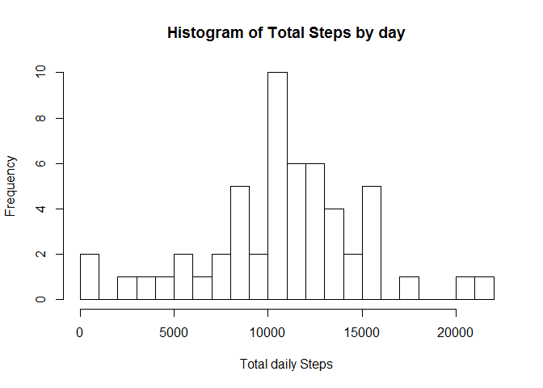
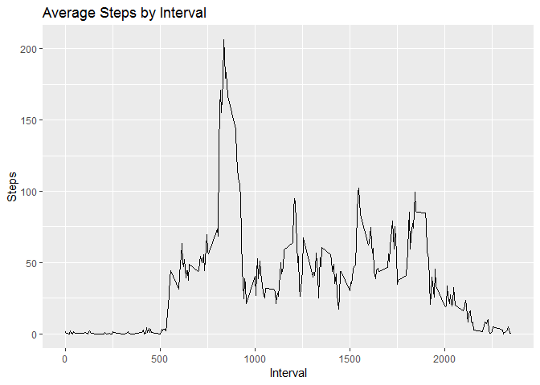
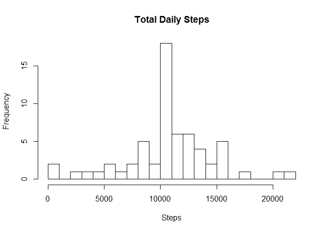
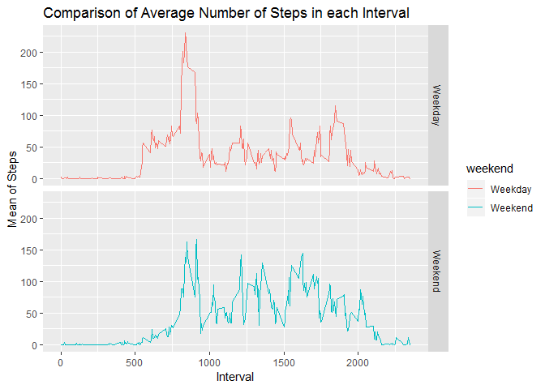

# Loading and preprocessing the data


# What is mean total number of steps taken per day?
##1. Calculate total number of steps taken per day.


```r
TotalSteps<- df%>% select(date, steps) %>% group_by(date) %>% summarize(totsteps= sum(steps)) %>% na.omit()
hist(TotalSteps$totsteps, xlab = "Total daily Steps",main="Histogram of Total Steps by day", breaks = 20)
```

<!-- -->

##2. Calculate Mean/Median number of steps taken per day.

```r
mean(TotalSteps$totsteps)
```

```
## [1] 10766.19
```

```r
median(TotalSteps$totsteps)
```

```
## [1] 10765
```


# What is the average daily activity pattern?
##1. Make a time series plot of the 5-minute interval (x-axis) and the average number of steps taken, averaged across all days (y-axis)

```r
library(ggplot2)
intdf <- df%>% select(interval, steps) %>% na.omit() %>% group_by(interval) %>% summarize(meansteps= mean(steps)) 
ggplot(intdf, aes(x=interval, y=meansteps))+ labs(title = "Average Steps by Interval", x = "Interval", y = "Steps")+  geom_line() 
```

<!-- -->


##2. Which 5-minute interval, on average across all the days in the dataset, contains the maximum number of steps?  

```r
intdf[which(intdf$meansteps== max(intdf$meansteps)),]
```

```
## # A tibble: 1 x 2
##   interval meansteps
##      <int>     <dbl>
## 1      835      206.
```
# Imputing missing values
##1.Calculate and report the total number of missing values in the dataset (i.e. the total number of rows with NAs)

```r
sum(is.na(df$steps))
```

```
## [1] 2304
```
##2. Devise a strategy for filling in all of the missing values in the dataset.
Strategy: Plan to  use the mean interval steps from Mean Steps for that NA interval.

```r
replacewithmean <- function(x) replace(x, is.na(x), mean(x, na.rm = TRUE))
meandata <- df%>% group_by(interval) %>% mutate(steps= replacewithmean(steps))
```
##3. Make a histogram of the total number of steps taken each day and Calculate and report the mean and median total number of steps taken per day.

```r
ReplacedData <- aggregate(meandata$steps, by=list(meandata$date), sum)

names(ReplacedData)[1] ="date"
names(ReplacedData)[2] ="totalsteps"

summary(ReplacedData)
```

```
##          date      totalsteps   
##  2012-10-01: 1   Min.   :   41  
##  2012-10-02: 1   1st Qu.: 9819  
##  2012-10-03: 1   Median :10766  
##  2012-10-04: 1   Mean   :10766  
##  2012-10-05: 1   3rd Qu.:12811  
##  2012-10-06: 1   Max.   :21194  
##  (Other)   :55
```

```r
hist(ReplacedData$totalsteps, xlab = "Steps", ylab = "Frequency", main = "Total Daily Steps", breaks = 20)
```

<!-- -->
##4. Compare the mean and median of Old and New data

```r
oldmean <- mean(TotalSteps$totsteps, na.rm = TRUE)
newmean <- mean(ReplacedData$totalsteps)
# Old mean and New mean
oldmean
```

```
## [1] 10766.19
```

```r
newmean
```

```
## [1] 10766.19
```

```r
oldmedian <- median(TotalSteps$totsteps, na.rm = TRUE)
newmedian <- median(ReplacedData$totalsteps)
# Old median and New median
oldmedian
```

```
## [1] 10765
```

```r
newmedian
```

```
## [1] 10766.19
```
# Are there differences in activity patterns between weekdays and weekends?

```r
meandata$date <- as.Date(meandata$date)
meandata$weekday <- weekdays(meandata$date)
meandata$weekend <- ifelse(meandata$weekday=="Saturday" | meandata$weekday=="Sunday", "Weekend", "Weekday" )
library(ggplot2)
meandataweekendweekday <- aggregate(meandata$steps , by= list(meandata$weekend, meandata$interval), na.omit(mean))
names(meandataweekendweekday) <- c("weekend", "interval", "steps")

ggplot(meandataweekendweekday, aes(x=interval, y=steps, color=weekend)) + geom_line()+
facet_grid(weekend ~.) + xlab("Interval") + ylab("Mean of Steps") +
    ggtitle("Comparison of Average Number of Steps in each Interval")
```

<!-- -->

